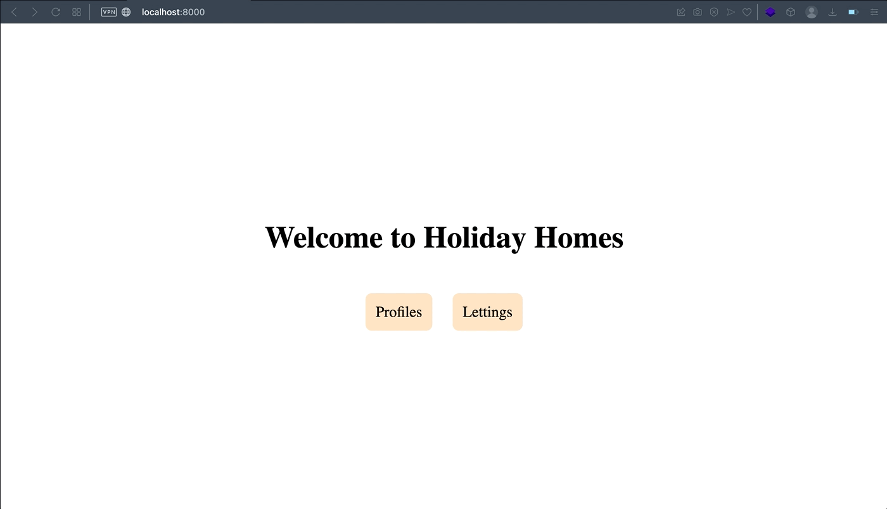
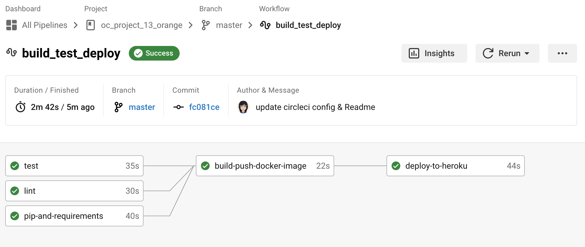

<div id="top"></div>

<!-- PROJECT SHIELDS -->
<!--
*** I'm using markdown "reference style" links for readability.
*** Reference links are enclosed in brackets [ ] instead of parentheses ( ).
*** See the bottom of this document for the declaration of the reference variables
*** for contributors-url, forks-url, etc. This is an optional, concise syntax you may use.
*** https://www.markdownguide.org/basic-syntax/#reference-style-links
-->
[![Contributors][contributors-shield]][contributors-url]
[![Forks][forks-shield]][forks-url]
[![Stargazers][stars-shield]][stars-url]
[![Issues][issues-shield]][issues-url]


<!-- PROJECT LOGO -->
<br />
<div align="center">

<h3 align="center">OC - PROJECT N°13 - Django App Deployment - CI/CD Pipeline </h3>

  <p align="center">
   Orange County Lettings is a small Django App deployed on Heroku and using a CI/CD Pipeline.
    <br />
    <a href="https://github.com/Jliezed/oc_project_12_epicevents">View Demo</a>
    ·
    <a href="https://github.com/Jliezed/oc_project_12_epicevents/issues">Report Bug</a>
    ·
    <a href="https://github.com/Jliezed/oc_project_12_epicevents/issues">Request Feature</a>
  </p>
</div>


<!-- ABOUT THE PROJECT -->
## Project Overview



<p align="right">(<a href="#top">back to top</a>)</p>


## Built With & Tools

* Python 
* Django
* Docker
* CircleCI
* Heroku
* Sentry

<p align="right">(<a href="#top">back to top</a>)</p>


<!-- GETTING STARTED -->
## Getting Started

### Clone the repo

   ```sh
   git clone https://github.com/Jliezed/oc_project_13_orange.git
   ```

### Run the app:
### -> with a virtual environment
Install venv library (if not yet in your computer)
   ```sh
   pip install venv
   ```
Create a virtual environment
   ```sh
   python -m venv env
   ```
Activate the virtual environment
   ```sh
   source env/bin/activate
   ```
#### Install packages using requirements.txt
   ```sh
   pip install -r requirements.txt
   ```
      
#### Access to the App by running the server
   ```sh
   python manage.py runserver
   ```
#### Go to http://127.0.0.0:8000/ to access the app
#### Go to http://127.0.0.0:8000/admin/ to access the admin panel (user: `admin`, password: `Abc1234!`)

### -> with Docker
#### Build the image
   ```sh
   docker build -t oc_project_13_orange .
   ```

#### Run the container
   ```sh
    docker run -p 8000:8000 oc_project_13_orange
   ```

#### Go to http://localhost:8000/ to access the app
#### Go to http://localhost:8000/admin/ to access the admin panel (user: `admin`, password: `Abc1234!`)

<p align="right">(<a href="#top">back to top</a>)</p>

## Lintings & Tests
### Run Flake8
   ```sh
   flake8
   ```
### Run Tests
   ```sh
  python manage.py test
   ```


<p align="right">(<a href="#top">back to top</a>)</p>

## Deployment - CI/CD Pipeline
Define in the `.circleci/config.yml` file the steps to be executed by CircleCI when a new commit is pushed to the repository.

### Step 1: Pip & Requirements
- Install pip
- Install requirements
- If the installation fails, the build is stopped
- If the installation passes, the build continues

### Step 2: Linting
- Run Flake8 to check the code quality
- If Flake8 fails, the build is stopped
- If Flake8 passes, the build continues

### Step 3: Testing
- Run tests
- If tests fail, the build is stopped
- If tests pass, the build continues
- Tests results are saved in CircleCI

### Step 4: Build Docker Image
- Build the Docker image
- If the build fails, the build is stopped
- If the build passes, the build continues
- The image is tagged with the commit SHA
- The image is pushed to Docker Hub
- Required: 
  - Pip & Requirements passed
  - Linting passed
  - Testing passed
- Only on branch: Master

### Step 5: Deploy to Heroku
- Deploy the Docker image to Heroku
- If the deployment fails, the build is stopped
- If the deployment passes, the build ends
- Required:
  - Build Docker Image passed
<p align="right">(<a href="#top">back to top</a>)</p>

<!-- CONTACT -->
## Contact

Jliezed

Project Link: [https://github.com/Jliezed/oc_project_13_orange.git](https://github.com/Jliezed/oc_project_13_orange.git)

<p align="right">(<a href="#top">back to top</a>)</p>


<!-- MARKDOWN LINKS & IMAGES -->
<!-- https://www.markdownguide.org/basic-syntax/#reference-style-links -->
[contributors-shield]: https://img.shields.io/github/contributors/Jliezed/oc_project_13_orange.svg?style=for-the-badge
[contributors-url]: https://github.com/Jliezed/oc_project_13_orange/graphs/contributors
[forks-shield]: https://img.shields.io/github/forks/Jliezed/oc_project_13_orange.svg?style=for-the-badge
[forks-url]: https://github.com/Jliezed/oc_project_13_orange/network/members
[stars-shield]: https://img.shields.io/github/stars/Jliezed/oc_project_13_orange.svg?style=for-the-badge
[stars-url]: https://github.com/Jliezed/oc_project_13_orange/stargazers
[issues-shield]: https://img.shields.io/github/issues/Jliezed/oc_project_13_orange.svg?style=for-the-badge
[issues-url]: https://github.com/Jliezed/oc_project_13_orange/issues
[license-shield]: https://img.shields.io/github/license/Jliezed/oc_project_13_orange.svg?style=for-the-badge
[license-url]: https://github.com/Jliezed/oc_project_13_orange/blob/master/LICENSE.txt
[linkedin-shield]: https://img.shields.io/badge/-LinkedIn-black.svg?style=for-the-badge&logo=linkedin&colorB=555
[linkedin-url]: https://linkedin.com/in/linkedin_username
[product-screenshot]: images/screenshot.png
